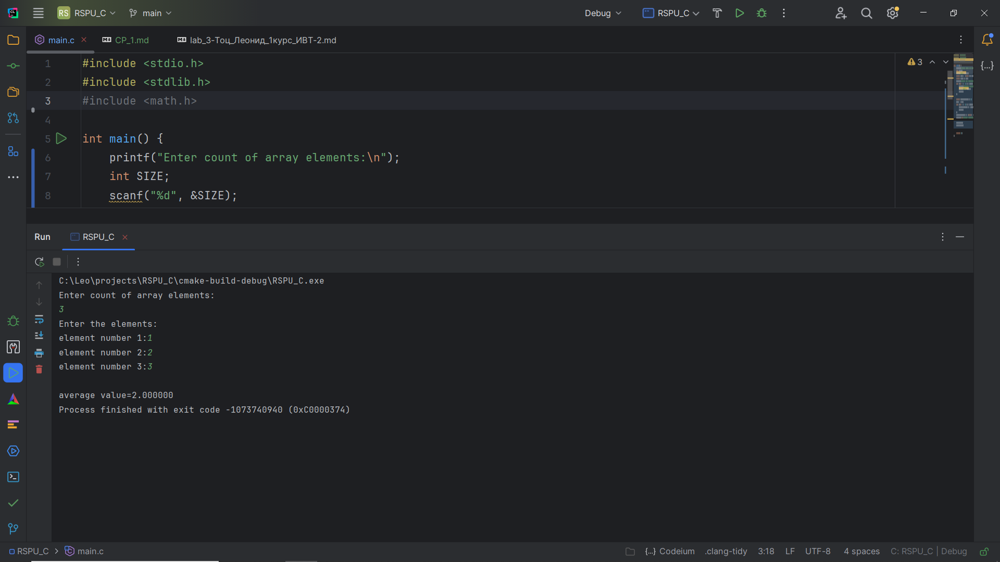
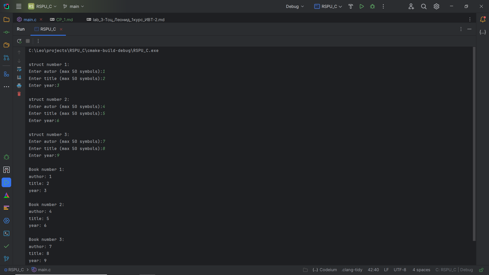

# Самостоятельная работа 1

## Задача 1. Динамический массив и вычисление среднего арифметического

### Постановка задачи

**Напишите программу на языке Си, которая:**
- Запрашивает у пользователя количество элементов массива (целое число N).
- Динамически выделяет память для массива из N элементов типа float.
- Заполняет массив значениями, введёнными с клавиатуры.
- Вычисляет и выводит среднее арифметическое всех элементов массива.
- При обращении к элементам массива используйте арифметику указателей (без оператора []).
- Освобождает выделенную память в конце работы программы.

Подсказка: Для обхода массива применяйте операции над указателем, например, увеличивая его значение на 1 для
перехода к следующему элементу

### Список идентификаторов
| Имя переменной | Тип переменной | Описание                               |
|----------------|----------------|----------------------------------------|
| SIZE           | int            | Размер массива                         |
| arr            | \*float        | Указатель на массив                    |
| arr2           | \*float        | Указатель на массив; бегает по массиву |

### Код программы
```c
#include <stdio.h>
#include <stdlib.h>
#include <math.h>

int main() {
    printf("Enter count of array elements:\n");
    int SIZE;
    scanf("%d", &SIZE);
    float *arr = (float *) malloc(SIZE * sizeof(float));
    float *arr2 = arr;
    printf("Enter the elements:\n");
    for (int i = 0; i < SIZE; i++) {
        printf("element number %d:", i + 1);
        scanf("%f", arr2);
        arr2++;
    }

    float average_value = 0;
    arr2 = arr;
    for (int i = 0; i < SIZE; i++) {
        average_value += *arr2;
        arr2++;
    }
    average_value /= (float) SIZE;
    printf("\naverage value=%f", average_value);

    free(arr);
    free(arr2);


    return 0;
}
```
### Результат работы программы


## Задача 2. Каталог книг

### Постановка задачи

**Создайте структуру Book, которая содержит следующие поля:**
- title – массив символов (строка) для хранения названия книги (максимум 50 символов); 
- author – массив символов для хранения имени автора (максимум 50 символов);
- year – целое число, обозначающее год издания книги

**Напишите программу, которая:**
- Создаёт массив из 3-х экземпляров структуры Book.
- Запрашивает у пользователя данные для каждой книги (название, автора и год издания).
- Выводит информацию обо всех книгах на экран, используя для этого отдельную функцию printBook(), которая
принимает указатель на структуру Book.

Подсказка: Используйте функцию fgets() для ввода строк и printf() для форматированного вывода.

### Список идентификаторов
| Имя переменной | Тип переменной | Описание                                               |
|----------------|----------------|--------------------------------------------------------|
| SIZE           | unsigned short | Максимальный допустимый размер поля "author" и "title" |
| title          | \*char         | Название книги                                         |
| author         | \*char         | Автор книги                                            |
| year           | unsigned short | Год выпуска книги                                      |
| arrBook        | struct Book*   | Массив книг                                            |

### Код программы

```c
#include <stdio.h>
#include <stdlib.h>
#include <math.h>

struct Book {
    unsigned short SIZE;
    char *title;
    char *author;
    unsigned short year;
};

void printbook(struct Book* book){
    printf("author: ");
    printf("%s", book->author);
    printf("\ntitle: ");
    printf("%s", book->title);
    printf("\nyear: %hd\n", book->year);
}

int main() {
    struct Book *arrBook = (struct Book*) malloc(3*sizeof(struct Book));
    for (int i = 0; i < 3; i++) {
        arrBook[i].SIZE = 50;
        arrBook[i].author = (char*) malloc(arrBook[i].SIZE*(sizeof(char)));
        arrBook[i].title = (char*) malloc(arrBook[i].SIZE*(sizeof(char)));
    }

    // Вводим данные в структуру
    for (int i = 0; i < 3; i++) {
        printf("\nstruct number %d:\n", i+1);
        printf("Enter autor (max 50 symbols):");
        scanf("%s", arrBook[i].author);
        printf("Enter title (max 50 symbols):");
        scanf("%s", arrBook[i].title);
        printf("Enter year:");
        scanf("%hd", &arrBook[i].year);
    }

    // Через функцию printbook() выводим структуры на экран
    printf("\n");
    for (int i = 0; i < 3; i++) {
        printf("Book number %d:\n", i);
        printbook(&arrBook[i]);
        printf("\n");
    }


    for (int i = 0; i < 3; i++){
        free(arrBook[i].title);
        free(arrBook[i].author);
    }
    free(arrBook);
    return 0;
}
```
### Результат выполнения программы


## Задача 3. Определение сезона по номеру месяца

### Постановка задачи
**Создайте перечисление Season со следующими значениями:**
- WINTER, SPRING, SUMMER, AUTUMN

**Напишите программу, которая:**
- Запрашивает у пользователя номер месяца (целое число от 1 до 12).
- На основе введённого номера месяца определяет и выводит соответствующий сезон:
  - Зима: декабрь (12), январь (1) и февраль (2);
  - Весна: март (3), апрель (4) и май (5);
  - Лето: июнь (6), июль (7) и август (8);
  - Осень: сентябрь (9), октябрь (10) и ноябрь (11).
  - Для определения сезона можно использовать условные операторы (if-else) или конструкцию switch.

Подсказка: Можно создать массив строк с названиями сезонов, индексируя его значением перечисления, или использовать switch-case для соответствия номера месяца и сезона.

### Список идентификаторов
| Имя переменной | Тип переменной | Описание                               |
|----------------|----------------|----------------------------------------|
| SIZE           | int            | Размер массива                         |
| arr            | \*float        | Указатель на массив                    |
| arr2           | \*float        | Указатель на массив; бегает по массиву |

### Код программы

```c

```

### Результат выполнения программы
