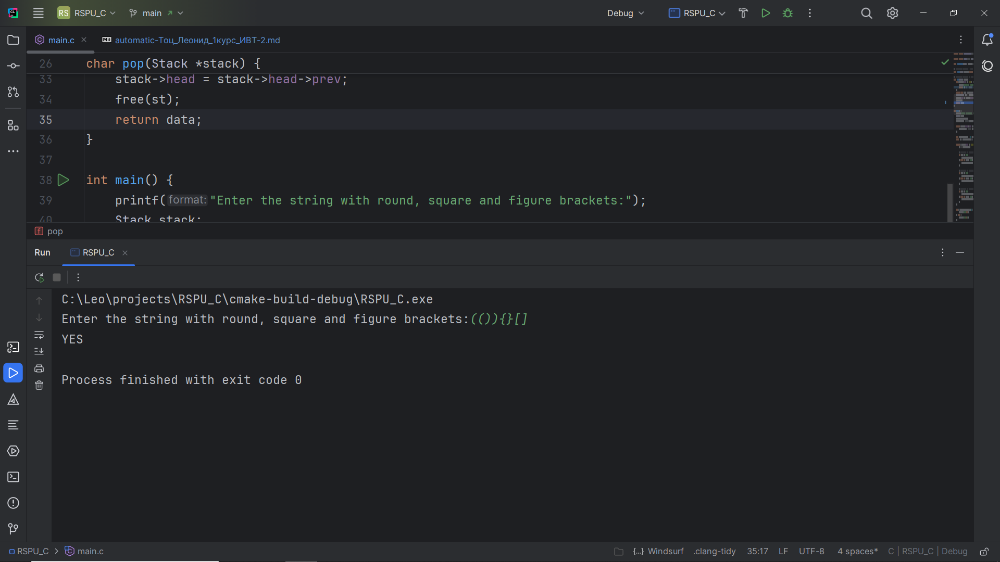
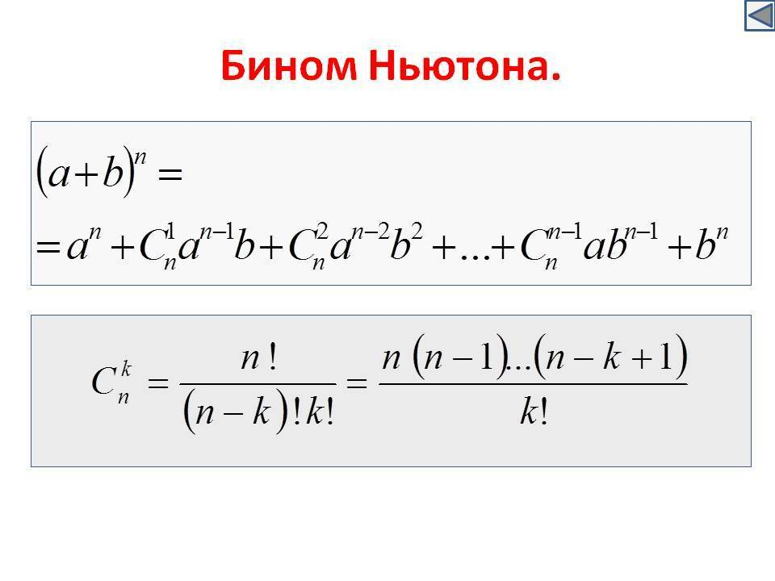
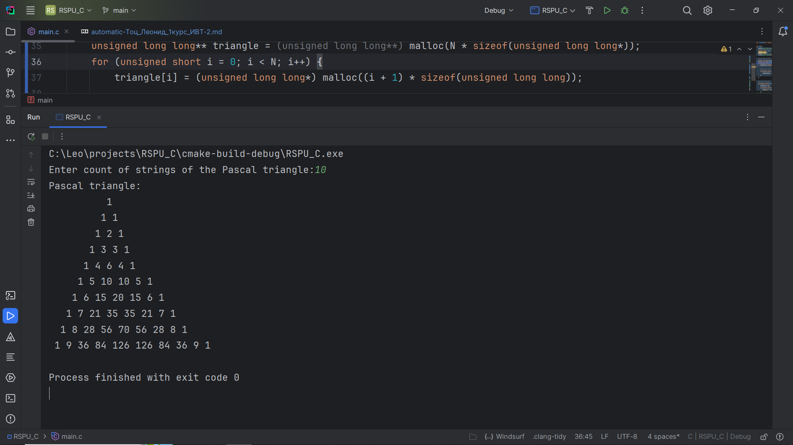
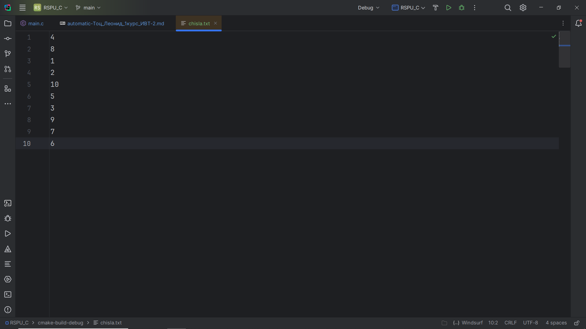
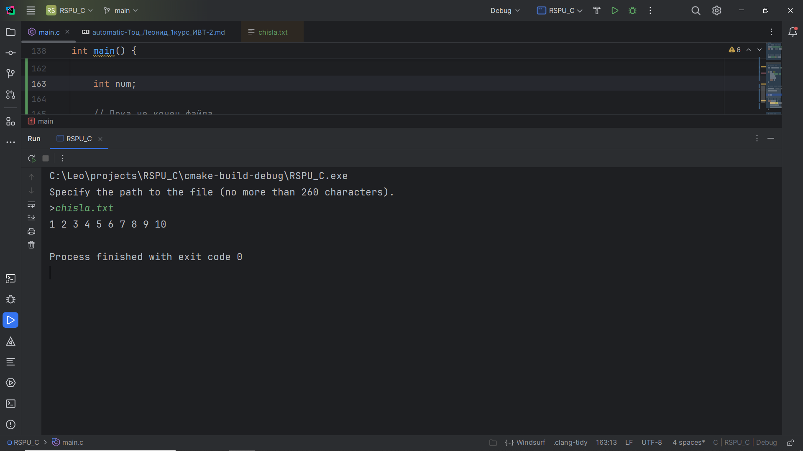

# Программирование - Язык C. Сдача автоматом

## Задание №1. Проверка сбалансированности скобок в выражении

### Постановка задачи
**Напишите программу для проверки корректности расстановки круглых, фигурных и квадратных скобок в заданной строке.**
- **Вход.** Строка с выражением, содержащим скобки (может включать и другие символы).
- **Выход.** Вывести YES, если все типы скобок в строке корректно сбалансированы, или NO – если допущена
ошибка в порядке скобок.
- **Требования.** Для проверки использовать стек. Алгоритм должен учитывать соответствие типов скобок
(например, \[ соответствует \]) и их порядок вложенности. Программа игнорирует несвязанные символы и
анализирует только скобки. При обнаружении несбалансированной скобочной структуры обработать ситуацию и вывести NO. Использование стека должно быть реализовано вручную (например, через массив
или связный список), без использования сторонних коллекций.

### Список идентификаторов
| Имя переменной  | Тип переменной | Описание                     |
|-----------------|----------------|------------------------------|
| stack           | Stack*         | указатель на стек            |
| round_brackets  | целое число    | количество круглых скобок    |
| figure_brackets | целое число    | количество фигурных скобок   |
| square_brackets | целое число    | количество квадратных скобок |
| ch              | char           | символ                       |


### Код программы
```c
#include <stdio.h>
#include <malloc.h>

typedef struct StackElement {
    struct StackElement *prev;
    char data;
} StackElement;

typedef struct Stack {
    StackElement *head;
} Stack;

void StackInit(Stack *stack) {
    stack->head = NULL;
}

// Добавление элемента в стек
void push(Stack *stack, const char data) {
    StackElement *element = (StackElement *) malloc(sizeof(StackElement));
    element->data = data;
    element->prev = stack->head;
    stack->head = element;
}

// Извлечения элемента из стека
char pop(Stack *stack) {
    if (stack->head == NULL) {
        printf("Stack is empty.\n");
        return 0; // В ASCII 0 обозначает NULL
    }
    const char data = stack->head->data;
    StackElement *st = stack->head;
    stack->head = stack->head->prev;
    free(st);
    return data;
}

int main() {
    printf("Enter the string with round, square and figure brackets:");
    Stack stack;
    StackInit(&stack);
    push(&stack, (char) getchar());

    while (stack.head->data != '\n') {
        push(&stack, (char) getchar());
    }

    int round_brackets = 0, figure_brackets = 0, square_brackets = 0;
    char ch = pop(&stack); // Здесь ch всегда = '/n' (символ переноса строки, он же Enter)

    while ((stack.head != NULL) && (ch != 0)) {
        ch = pop(&stack);

        // Проверка на круглые скобки
        if (ch == '(') {
            round_brackets++;
        } else if (ch == ')') {
            round_brackets--;
        }

        // Проверка на фигурные скобки
        if (ch == '{') {
            figure_brackets++;
        } else if (ch == '}') {
            figure_brackets--;
        }

        // Проверка на квадратные скобки
        if (ch == '[') {
            square_brackets++;
        } else if (ch == ']') {
            square_brackets--;
        }
    }

    if ((round_brackets == 0) && (figure_brackets == 0) && (square_brackets == 0)) {
        printf("YES\n");
    } else {
        printf("NO\n");
    }

    return 0;
}
```
## Результат работы программы


## Задание №3. Генерация треугольника Паскаля

### Постановка задачи
Напишите программу, которая выводит первые N строк треугольника Паскаля.
- **Вход.** Целое число N – количество требуемых строк треугольника Паскаля.
- **Выход.** N строк, каждая из которых содержит соответствующие коэффициенты треугольника Паскаля, разделённые пробелами.
- **Требования.** Для хранения каждой строки треугольника динамически выделять массив соответствующего
размера. Не использовать фиксированные размерности массивов, расчёт должен работать для любого N
разумного размера. После генерации всех строк освободить всю выделенную память (не допускать утечки
памяти).

### Математическая модель


### Список идентификаторов
| Имя переменной | Тип переменной       | Описание                      |
|----------------|----------------------|-------------------------------|
| N              | unsigned short       | количество строк треугольника |
| i              | unsigned short       | индекс строки                 |
| k              | unsigned short       | индекс элемента строки        |
| triangle       | unsigned long long** | треугольник Паскаля           |

### Код программы
```c
#include <stdio.h>
#include <stdlib.h>

// Функция вычисления факториала
unsigned long long factorial(const unsigned long long n) {
    if (n == 0) {
        return 1;
    }
    unsigned long long result = 1;
    for (unsigned long long i = 1; i <= n; i++) {
        result *= i;
    }
    return result;
}

// Функция вычисления биноминального коэффициента
unsigned long long C(const unsigned short n, const unsigned short k) {
    return factorial(n) / (factorial(k) * factorial(n - k));
}

// Печать пробелов для красивого треугольника
void PreSpaces(const unsigned short count) {
    for (unsigned short i = 0; i < count; i++) {
        printf(" ");
    }
}

int main() {
    printf("Enter count of strings of the Pascal triangle:");
    unsigned short N = 0; // от 0 до 65535
    scanf("%hd", &N);
    printf("Pascal triangle:\n");

    // Динамически выделяем память под массив, в котором будем хранить треугольник Паскаля
    unsigned long long** triangle = (unsigned long long**) malloc(N * sizeof(unsigned long long*));
    for (unsigned short i = 0; i < N; i++) {
        triangle[i] = (unsigned long long*) malloc((i + 1) * sizeof(unsigned long long));

        // Используем бином Ньютона, чтобы построить треугольник Паскаля
        for (unsigned short k = 0; k <= i; k++) {
            triangle[i][k] = C(i, k);
        }
    }

    // Печатаем треугольник
    for (unsigned short i = 0; i < N; i++) {
        PreSpaces(N - i);
        for (unsigned short k = 0; k <= i; k++) {
            printf("%llu ", triangle[i][k]);
        }
        printf("\n");
    }

    // Освобождаем память
    for (unsigned short i = 0; i < N; i++) {
        free(triangle[i]);
    }
    free(triangle);

    return 0;
}
```
### Результат работы программы


## Задание №10. Сортированный связный список

### Постановка задачи
Реализуйте программу, которая читает последовательность чисел и сохраняет их в отсортированном порядке с использованием связного списка.
- **Вход.** Имя текстового файла с исходными данными передается через командную строку. Файл содержит
целые числа, по одному в строке, в произвольном порядке.
- **Выход.** Те же числа, выведенные в возрастающем порядке, по одному в строке (от меньшего к большему
значению).
- **Требования.** Для хранения чисел использовать односвязный список: каждый считанный элемент вставлять в список сразу в нужную позицию, поддерживая сортированный порядок списка на этапе вставки
(не сортировать весь список заново после заполнения, а именно вставлять в правильное место). Не использовать массивы для хранения всех элементов сразу – добавление элементов происходит по одному с
динамическим выделением памяти под каждый новый узел списка. После считывания всех чисел и вывода
результата очистить память, выделенную под узлы связного списка. Алгоритм должен эффективно обрабатывать большие входные файлы (по памяти ограничен только размерами доступной памяти, по времени
– вставка каждого элемента должна выполняться за время, пропорциональное длине списка).


### Список идентификаторов
| Имя переменной | Тип переменной | Описание                 |
|----------------|----------------|--------------------------|
| stack          | Stack*         | указатель на стек        |
| path           | char*          | путь к файлу             |
| f              | FILE*          | указатель на файл        |
| num            | int            | число считанное из файла |

### Код программы
```c
#include <stdio.h>
#include <malloc.h>
#include <string.h>

typedef struct StackElement {
    struct StackElement *next;
    struct StackElement *prev;
    int data;
} StackElement;

typedef struct Stack {
    StackElement *head;
} Stack;

void StackInit(Stack *stack) {
    if (stack == NULL) {
        printf("Stack is empty.\n");
        return;
    }
    stack->head = NULL;
}

// Добавление элемента в стек
void push(Stack *stack, const int data) {
    if (stack == NULL) {
        printf("Stack is empty.\n");
        return;
    }
    StackElement *stack_element = (StackElement *) malloc(sizeof(StackElement));
    stack_element->data = data;
    stack_element->prev = stack->head;

    if (stack->head != NULL) {
        stack_element->prev->next = stack_element;
    }

    stack->head = stack_element;
    stack_element->next = NULL;
}

// Извлечения элемента из стека
int pop(Stack *stack) {
    if (stack == NULL || stack->head == NULL) {
        printf("Stack is empty.\n");
        return 0; // В ASCII 0 обозначает NULL
    }

    const int data = stack->head->data;

    // Если стек состоит из одного элемента
    if (stack->head->prev == NULL) {
        stack->head = NULL;
        return data;
    }

    stack->head = stack->head->prev;
    stack->head->next->prev = NULL;
    stack->head->next = NULL;


    return data;
}

// Функция меняет местами два элемента стека
void swap(StackElement *left, StackElement *right) {
    // left - левый элемент
    // right - правый элемент
    // Если конец стека
    if (left == NULL) {
        return;
    }


    if (left->prev != NULL && right->next != NULL) {
        right->prev = left->prev;
        left->prev->next = right;

        right->next->prev = left;
        left->next = right->next;

        left->prev = right;
        right->next = left;
    }
    else if (left->prev != NULL && right->next == NULL) {
        right->prev = left->prev;
        left->prev->next = right;

        left->prev = right;
        right->next = left;

        left->next = NULL;
    }
    else if (left->prev == NULL && right->next != NULL) {
        left->prev = right;
        right->prev = NULL;

        left->next = right->next;
        right->next->prev = left;

        right->next = left;
    }
    else if (left->prev == NULL && right->next == NULL) {
        left->prev = right;
        right->next = left;

        left->next = NULL;
        right->prev = NULL;
    }
}

void siftStackElement(Stack *stack) {
    if (stack == NULL) {
        printf("Stack is empty.\n");
        return;
    }

    StackElement *left = stack->head->prev;
    StackElement *right = stack->head;

    while (left != NULL && left->data < right->data) {
        swap(left, right); // Меняет местами два элемента

        // Если менялась голова, то возвращаем её на место
        if (stack->head == right) {
            stack->head = left;
        }

        // Обновляем указатели. Меняем левый и правый местами, а также сдвигаем их на один элемент влево
        StackElement *temp = left;
        left = right;
        right = temp;

        left = left->prev;
        right = right->prev;
    }
}

int main() {
    // В Windows длина пути к файлу не превышает 260 символов, поэтому _MAX_PATH = 260
    printf("Specify the path to the file (no more than %d characters).\n>", _MAX_PATH);
    char *path = (char*) malloc(_MAX_PATH * sizeof(char));


    // Считываем не более 260 символов и до того момента, пока не встретим символ '\n'
    scanf("%260[^\n]", path);


    // Открываем файл
    FILE *f = fopen(path, "r");

    if (f == NULL) {
        printf("The file does not exist.\n");
        fclose(f);
        free(path);
        return 0;
    }

    // Создаём связный список. Им будет стек.
    Stack *stack = (Stack *) malloc(sizeof(Stack));
    StackInit(stack);

    int num;

    // Пока не конец файла
    while (!feof(f)) {
        fscanf(f, "%d", &num); // Считываем число
        push(stack, num); // Добавляем его в стек
        siftStackElement(stack); // Просеваем число в стеке
    }

    // Выводим стек
    while (stack->head != NULL) {
        printf("%d ", pop(stack));
    }
    printf("\n");

    fclose(f);
    free(path);
    free(stack);

    return 0;
}
```
### Результат работы программы



## Задание №9. 

### Постановка задачи


### Список идентификаторов

### Код программы
```c

```
### Результат работы программы


## Информация о студенте
Тоц Леонид Александрович, 1 курс, ИВТ-2