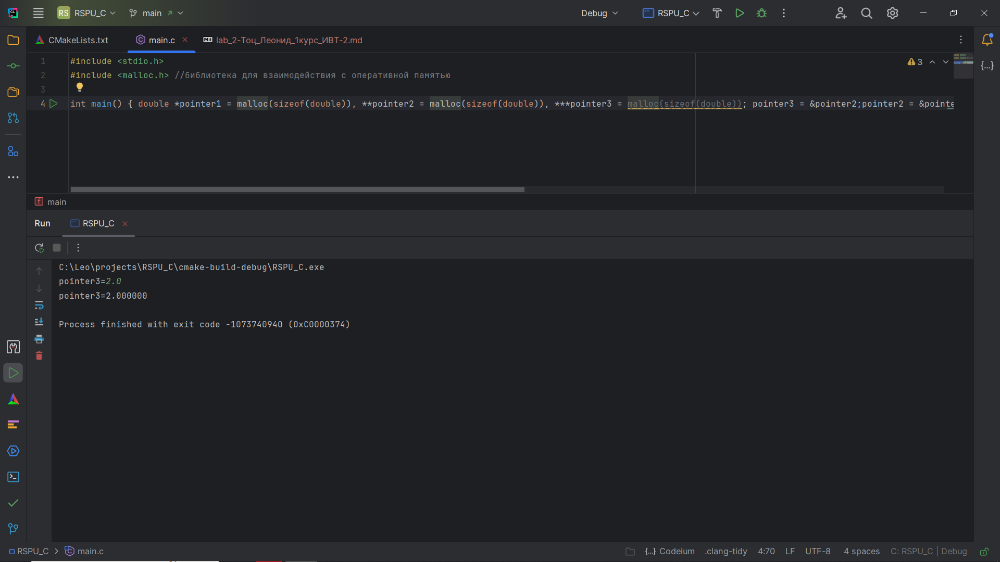
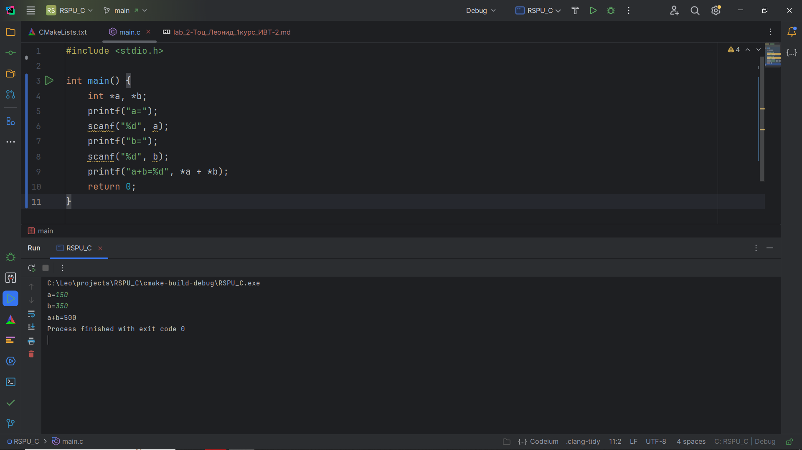
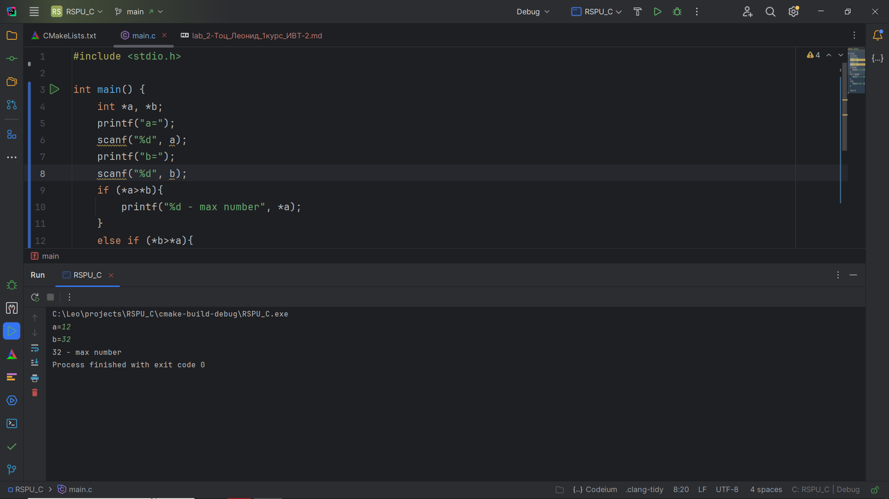

# Лабораторная работа 2 - Указатели, арифметика указателей

## Задание 1. Внутри функции `int main(void) { /*...*/ }`

### Постановка задачи:
Внутри функции `int main(void) { /*...*/ }` определите указатель double \*\*\*pointer = NULL;. Инициализируйте этот указатель адресом другого указателя типа double\*\*, который указывает на переменную
double\*, указывающую на double. Используйте pointer для записи и чтения значения 2.0 в сегмент
оперативной памяти для double.

Требования:
* Используйте функции типа \*alloc(...) для выделения оперативной памяти под динамические объекты
  double\*\*, double\* и double.
* Запишите и выведите число, указанное в блоке double на диаграмме, на экран, используя указатель double
  \*\*\*pointer = NULL;.
* Используйте функцию free(...) для освобождения оперативной памяти, выделенной под динамические объекты с применением переменной pointer.
* Запишите всё решение в одну строку одним выражением (statement).


### Список идентификаторов
| Имя переменной | Тип переменной | Описание                                      |
|----------------|----------------|-----------------------------------------------|
| pointer        | double***      | Указатель на указатель на указатель на double |
| pointer2       | double**       | Указатель на указатель на double              |
| pointer3       | double*        | Указатель на double                           |

### Код программы
```c
#include <stdio.h>
#include <malloc.h> //библиотека для взаимодействия с оперативной памятью

int main() { double *pointer1 = malloc(sizeof(double)), **pointer2 = malloc(sizeof(double)), ***pointer3 = malloc(sizeof(double)); pointer3 = &pointer2;pointer2 = &pointer1;printf("pointer3="); scanf("%lf", **pointer3); printf("pointer3=%lf\n", ***pointer3); free(**pointer3); free(*pointer3); free(pointer3); return 0; }
```

### Результат работы программы


## Задание 2. Сложение двух чисел:

### Постановка задачи:
Напишите программу, которая складывает два числа с использованием указателей на эти числа.

### Список идентификаторов
| Имя переменной  | Тип переменной | Описание                         |
|-----------------|----------------|----------------------------------|
| a               | int*           | Указатель на переменную типа int |
| b               | int*           | Указатель на переменную типа int|

### Код программы
```c
#include <stdio.h>

int main() {
    int *a, *b;
    printf("a=");
    scanf("%d", a);
    printf("b=");
    scanf("%d", b);
    printf("a+b=%d", *a + *b);
    return 0;
}
```

### Результат работы программы


## Задание 3. Нахождение максимума из двух чисел

### Постановка задачи
Напишите программу, которая находит максимальное число из двух чисел, используя указатели на эти числа.

### Список идентификаторов
| Имя переменной  | Тип переменной | Описание                         |
|-----------------|----------------|----------------------------------|
| a               | int*           | Указатель на переменную типа int |
| b               | int*           | Указатель на переменную типа int|

### Код программы
```c
#include <stdio.h>

int main() {
    int *a, *b;
    printf("a=");
    scanf("%d", a);
    printf("b=");
    scanf("%d", b);
    if (*a>*b){
        printf("%d - max number", *a);
    }
    else if (*b>*a){
        printf("%d - max number", *b);
    }
    else{
        printf("%d equal %d", *a, *b);
    }

    return 0;
}
```

### Результат работы программы


## Задание 4. Динамический массив с плавающей точкой

### Постановка задачи
Напишите программу, которая создаёт одномерный динамический массив из чисел с плавающей точкой двойной точности, заполняет его значениями с клавиатуры и распечатывает все элементы этого массива, используя
арифметику указателей (оператор +), а не оператор доступа к элементу массива [].

### Список идентификаторов
| Имя переменной | Тип переменной | Описание                                |
|----------------|----------------|-----------------------------------------|
| arr            | int[]*         | Динамический массив указателей типа int |
| c              | int*           | Указатель на переменную типа int        |

### Код программы
```c

```


