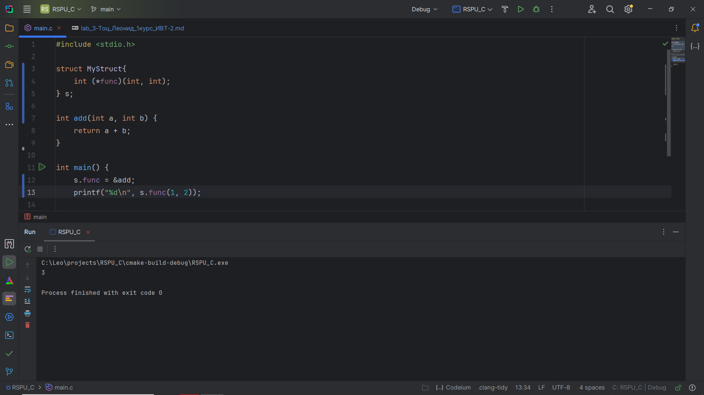
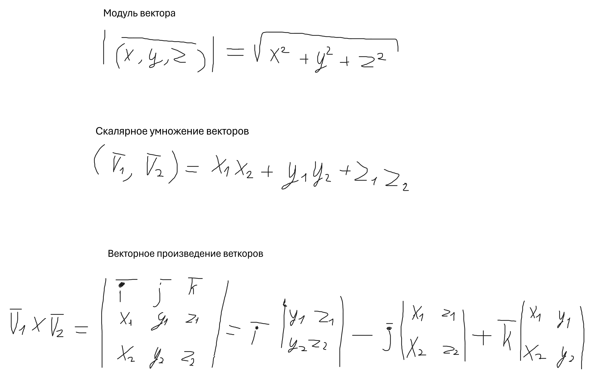
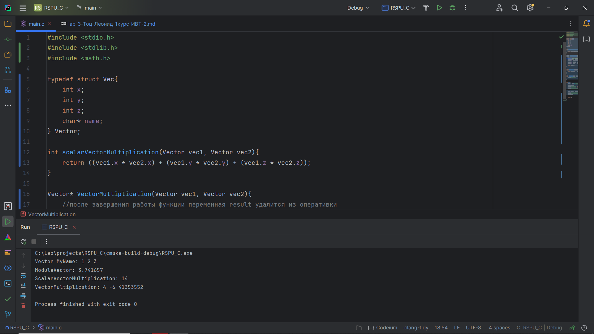
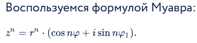

# Структуры. Объединения. Перечисления. Лабораторная работа № 3. Задачи.

## Комплект 1. Структуры.
## Задание 1.1

### Постановка задачи
Создать некоторую структуру с указателем на некоторую функцию
в качестве поля. Вызвать эту функцию через имя переменной этой
структуры и поле указателя на функцию.

### Список идентификаторов
| Имя переменной | Тип переменной | Описание                  |
|----------------|----------------|---------------------------|
| s              | MyStruct       | Переменная типа MyStruct  |
| func           | \*void         | Указатель на функцию      |

### Код программы
```c
#include <stdio.h>

struct MyStruct{
    int (*func)(int, int);
} s;

int add(int a, int b) {
    return a + b;
}

int main() {
    s.func = &add;
    printf("%d\n", s.func(1, 2));

    return 0;
}
```
### Результат работы программы



## Задание 1.2

### Постановка задачи
Создать структуру для вектора в 3-х мерном пространстве. Реализовать и использовать в своей программе следующие операции над
векторами:
1. Скалярное умножение векторов;
2. Векторное произведение;
3. Модуль вектора;
4. Распечатка вектора в консоли.

### Математическая модель


### Список идентификаторов
| Имя переменной | Тип переменной | Описание                  |
|----------------|----------------|---------------------------|
| s              | MyStruct       | Переменная типа MyStruct  |
| func           | \*void         | Указатель на функцию      |
### Код программы
```c
#include <stdio.h>
#include <stdlib.h>
#include <math.h>

typedef struct Vec{
    int x;
    int y;
    int z;
    char* name;
} Vector;

int scalarVectorMultiplication(Vector vec1, Vector vec2){
    return ((vec1.x * vec2.x) + (vec1.y * vec2.y) + (vec1.z * vec2.z));
}

Vector* VectorMultiplication(Vector vec1, Vector vec2){
    //после завершения работы функции переменная result удалится из оперативки
    Vector* result = (Vector*) malloc(sizeof(Vector));
    result->x = (vec1.y* vec2.z) - (vec1.z * vec2.y);
    result->y = -((vec1.x * vec2.z) + (vec1.z * vec2.x));
    result->x = (vec1.x * vec2.y) + (vec1.y * vec2.x);
    return result; //перед удалением result будет возвращен указатель
}

double ModuleVector(Vector vec1){
    return sqrt((vec1.x * vec1.x) + (vec1.y * vec1.y) + (vec1.z * vec1.z));
}

void PrintVector(Vector vec1){
    printf("Vector %s: %d %d %d\n", vec1.name, vec1.x, vec1.y, vec1.z);
}

int main() {
    Vector v = {1,2,3, "MyName"};
    PrintVector(v);
    printf("ModuleVector: %f\n", ModuleVector(v));
    printf("ScalarVectorMultiplication: %d\n", scalarVectorMultiplication(v, v));

    Vector *result = VectorMultiplication(v, v);
    printf("VectorMultiplication: %d %d %d\n", result->x, result->y, result->z);
    free(result);

    return 0;
}
```
### Результат работы программы


## Задание 1.3

### Постановка задачи
Вычислить, используя структуру комплексного числа, комплексную экспоненту exp(z) некоторого z ∈ C.

### Математическая модель


### Список идентификаторов
| Имя переменной | Тип переменной | Описание                  |
|----------------|----------------|---------------------------|
| s              | MyStruct       | Переменная типа MyStruct  |
| func           | \*void         | Указатель на функцию      |

### Код программы
```c
#include <stdio.h>
#include <math.h>

typedef struct Complex {
double real;
double imag;
}Complex;

int factorial(int n) {
if (n == 0) {
return 1;
}

    int sum = 1;
    for (int i = 1; i <= n; i++) {
        sum *= i;
    }
    return sum;
}

Complex powComplex(Complex z, int n) {

    // Используем формулу Муавра. Для этого найдём угол поворота (Fi) фи и расстояние (r).
    double r = sqrt(z.real * z.real + z.imag * z.imag); // Расстояние
    double Fi = atan(z.imag / z.real); // Угол поворота

    double r_n = pow(r, n); // Расстояние в степени n. Вычисляем сейчас, чтобы потом не вычислять два раза.
    z.real = r_n * cos(n*Fi); // Вещественная часть
    z.imag = r_n * sin(n*Fi); // Мнимая часть

    return z;
}

int main() {
printf("z = a + bi\nEnter the Real part:");
Complex z;
scanf("%lf", &z.real);
printf("Enter the Imaginary part:");
scanf("%lf", &z.imag);
printf("z = %lf + %lfi\n\n", z.real, z.imag);

    Complex c = {0, 0};
    Complex c_stakan;
    double fraction; // Дробная часть выражения
    for (int i = 0; i <= 20; i++) {
        fraction = 1.0 / factorial(i);
        c_stakan = powComplex(z, i);
        c.real += c_stakan.real * fraction;
        c.imag += c_stakan.imag * fraction;
    }

    printf("e^(i*Fi) = %lf + %lfi\n", c.real, c.imag);


    return 0;
}
```
### Результат работы программы


## Задание 1.4

### Постановка задачи

### Математическая модель

### Список идентификаторов

### Код программы

### Результат работы программы


## Задание 1.5

### Постановка задачи

### Математическая модель

### Список идентификаторов

### Код программы

### Результат работы программы


## Комплект 2. Объединения и перечисления

## Задание 2.1

### Постановка задачи

### Математическая модель

### Список идентификаторов

### Код программы

### Результат работы программы


## Задание 2.2

### Постановка задачи

### Математическая модель

### Список идентификаторов

### Код программы

### Результат работы программы


## Задание 2.3

### Постановка задачи

### Математическая модель

### Список идентификаторов

### Код программы

### Результат работы программы


## Задание 2.4

### Постановка задачи

### Математическая модель

### Список идентификаторов

### Код программы

### Результат работы программы


## Информация о студенте
Тоц Леонид Александрович, 1 курс, ИВТ-2