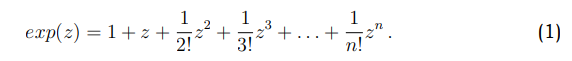
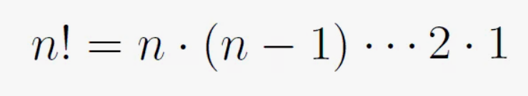
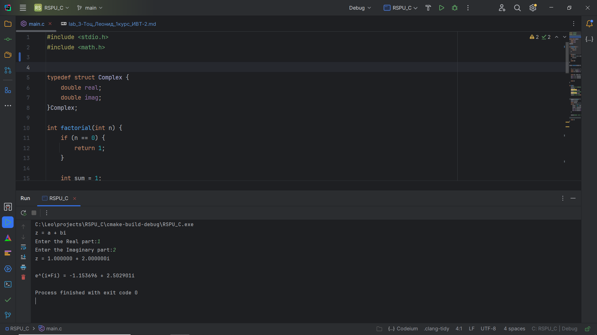
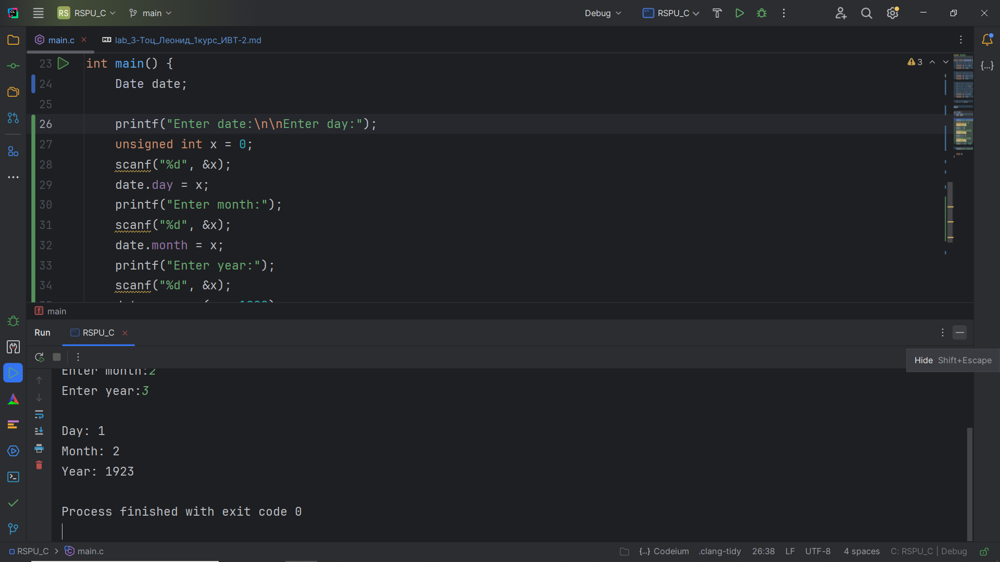
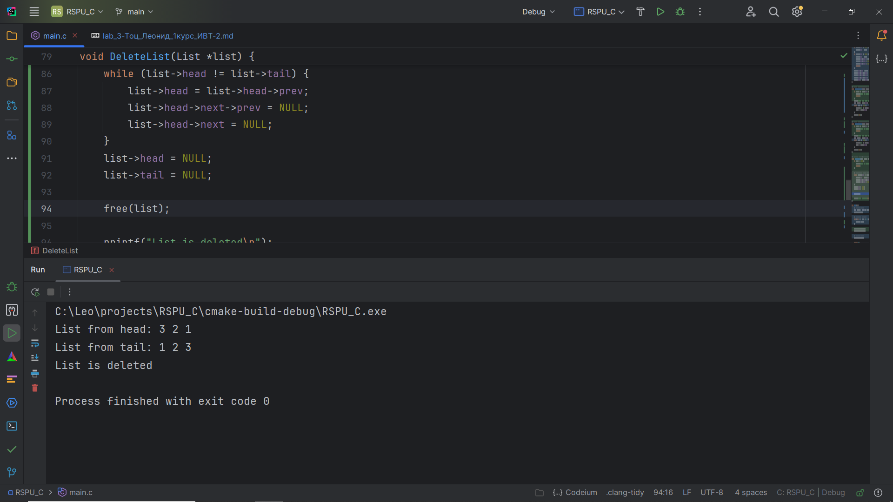
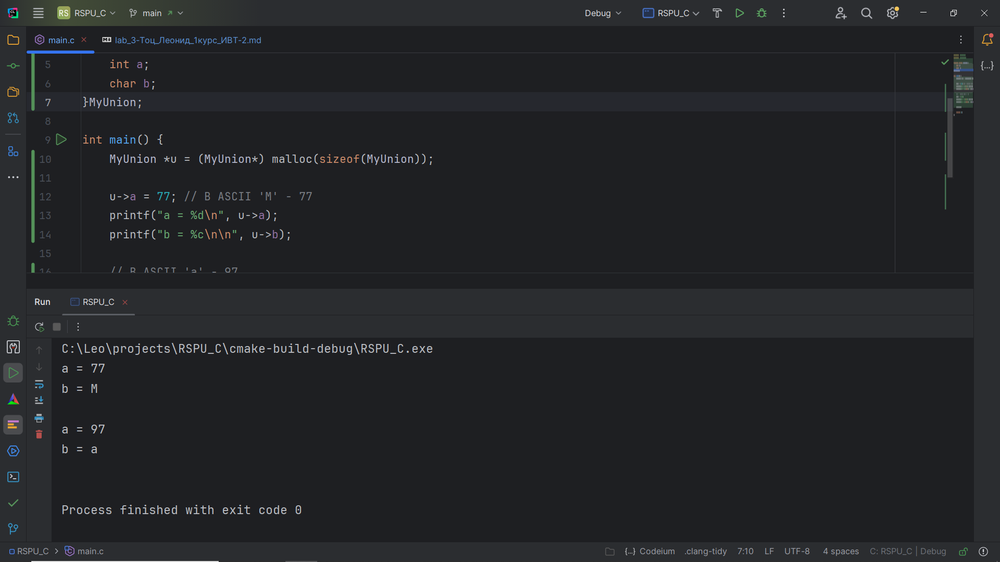
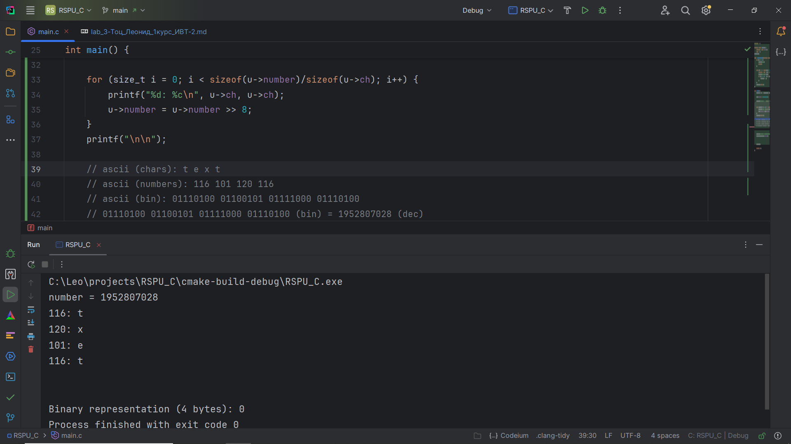
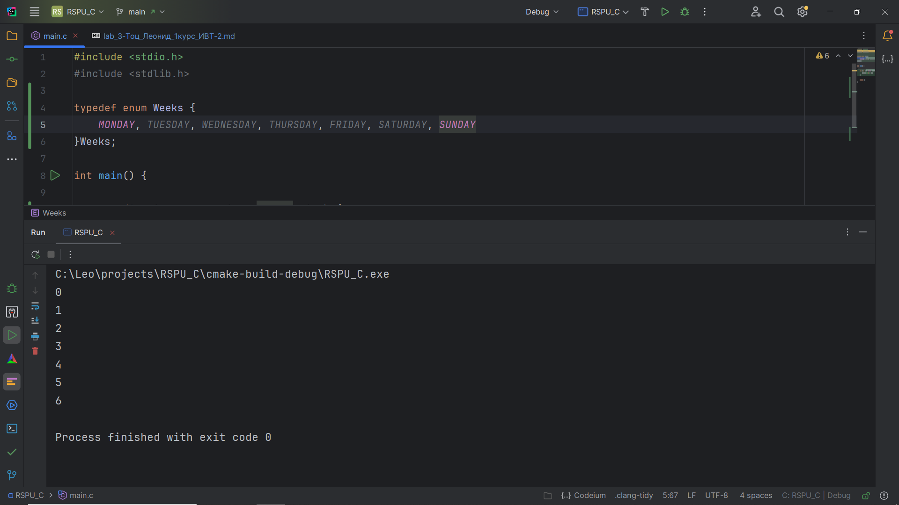
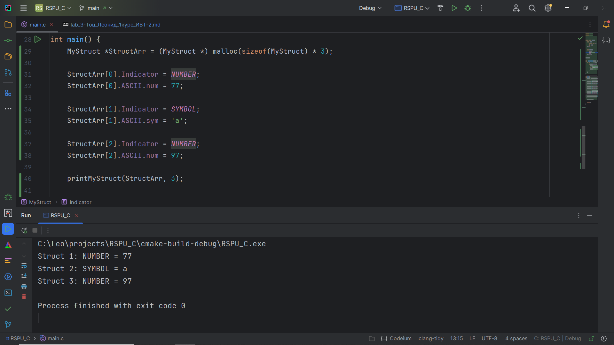

# Структуры. Объединения. Перечисления. Лабораторная работа № 3. Задачи.

## Комплект 1. Структуры.
## Задание 1.1

### Постановка задачи
Создать некоторую структуру с указателем на некоторую функцию
в качестве поля. Вызвать эту функцию через имя переменной этой
структуры и поле указателя на функцию.

### Список идентификаторов
| Имя переменной | Тип переменной | Описание                  |
|----------------|----------------|---------------------------|
| s              | MyStruct       | Переменная типа MyStruct  |
| func           | \*void         | Указатель на функцию      |

### Код программы
```c
#include <stdio.h>

struct MyStruct{
    int (*func)(int, int);
} s;

int add(int a, int b) {
    return a + b;
}

int main() {
    s.func = &add;
    printf("%d\n", s.func(1, 2));

    return 0;
}
```
### Результат работы программы


## Задание 1.2

### Постановка задачи
Создать структуру для вектора в 3-х мерном пространстве. Реализовать и использовать в своей программе следующие операции над
векторами:
1. Скалярное умножение векторов;
2. Векторное произведение;
3. Модуль вектора;
4. Распечатка вектора в консоли.

### Математическая модель


### Список идентификаторов
| Имя переменной | Тип переменной | Описание                  |
|----------------|----------------|---------------------------|
| s              | MyStruct       | Переменная типа MyStruct  |
| func           | \*void         | Указатель на функцию      |
### Код программы
```c
#include <stdio.h>
#include <stdlib.h>
#include <math.h>

typedef struct Vec{
    int x;
    int y;
    int z;
    char* name;
} Vector;

int scalarVectorMultiplication(Vector vec1, Vector vec2){
    return ((vec1.x * vec2.x) + (vec1.y * vec2.y) + (vec1.z * vec2.z));
}

Vector* VectorMultiplication(Vector vec1, Vector vec2){
    //после завершения работы функции переменная result удалится из оперативки
    Vector* result = (Vector*) malloc(sizeof(Vector));
    result->x = (vec1.y* vec2.z) - (vec1.z * vec2.y);
    result->y = -((vec1.x * vec2.z) + (vec1.z * vec2.x));
    result->x = (vec1.x * vec2.y) + (vec1.y * vec2.x);
    return result; //перед удалением result будет возвращен указатель
}

double ModuleVector(Vector vec1){
    return sqrt((vec1.x * vec1.x) + (vec1.y * vec1.y) + (vec1.z * vec1.z));
}

void PrintVector(Vector vec1){
    printf("Vector %s: %d %d %d\n", vec1.name, vec1.x, vec1.y, vec1.z);
}

int main() {
    Vector v = {1,2,3, "MyName"};
    PrintVector(v);
    printf("ModuleVector: %f\n", ModuleVector(v));
    printf("ScalarVectorMultiplication: %d\n", scalarVectorMultiplication(v, v));

    Vector *result = VectorMultiplication(v, v);
    printf("VectorMultiplication: %d %d %d\n", result->x, result->y, result->z);
    free(result);

    return 0;
}
```
### Результат работы программы


## Задание 1.3

### Постановка задачи
Вычислить, используя структуру комплексного числа, комплексную экспоненту exp(z) некоторого z ∈ C.

### Математическая модель



### Список идентификаторов
| Имя переменной | Тип переменной | Описание                                            |
|----------------|----------------|-----------------------------------------------------|
| Complex        | struct         | Содержит в себе double real и double imag           |
| z              | Complex        | Комплексное число, вводится с консоли пользователем |
| c              | Complex        | Комплексная экспонента                              |
| c_stakan       | Complex        | Комплексное число - стакан                          |
| fraction       | double         | Дробная часть выражения                             |

### Код программы
```c
#include <stdio.h>
#include <math.h>

typedef struct Complex {
    double real;
    double imag;
}Complex;

int factorial(int n) {
    if (n == 0) {
        return 1;
    }

    int sum = 1;
    for (int i = 1; i <= n; i++) {
        sum *= i;
    }
    return sum;
}

Complex powComplex(Complex z, int n) {

    // Используем формулу Муавра. Для этого найдём угол поворота (Fi) фи и расстояние (r).
    double r = sqrt(z.real * z.real + z.imag * z.imag); // Расстояние
    double Fi = atan(z.imag / z.real); // Угол поворота

    double r_n = pow(r, n); // Расстояние в степени n. Вычисляем сейчас, чтобы потом не вычислять два раза.
    z.real = r_n * cos(n*Fi); // Вещественная часть
    z.imag = r_n * sin(n*Fi); // Мнимая часть

    return z;
}

int main() {
    printf("z = a + bi\nEnter the Real part:");
    Complex z;
    scanf("%lf", &z.real);
    printf("Enter the Imaginary part:");
    scanf("%lf", &z.imag);
    printf("z = %lf + %lfi\n\n", z.real, z.imag);

    
    Complex c = {0, 0};
    Complex c_stakan;
    double fraction; // Дробная часть выражения
    for (int i = 0; i <= 20; i++) {
        fraction = 1.0 / factorial(i);
        c_stakan = powComplex(z, i);
        c.real += c_stakan.real * fraction;
        c.imag += c_stakan.imag * fraction;
    }

    printf("e^(i*Fi) = %lf + %lfi\n", c.real, c.imag);


    return 0;
}
```
### Результат работы программы


## Задание 1.4

### Постановка задачи
Используя так называемые "битовые" поля в структуре C, создать экономную структуру в оперативной памяти для заполнения даты некоторого события, например даты рождения человека. Ссылки на описание битовых полей.


### Список идентификаторов
| Имя переменной | Тип переменной  | Описание                                             |
|----------------|-----------------|------------------------------------------------------|
| Date           | struct          | Содержит в себе int day, int month, int year         |
| date           | Date            | Дата, вводится с консоли пользователем               |

### Код программы
```c
#include <stdio.h>

typedef struct DateBirthday {
    // Дней в месяце может быть не больше 2^5 = 32 bit, то есть 32 разных значения.
    unsigned int day : 5; // выделяется 5 бит
    unsigned int : 3; // Следующие 3 бита в первом байте не используются

    // Месяц может быть не больше 2^4 = 16 bit, то есть 16 разных значения.
    unsigned int month : 4; // выделяется 4 бит
    unsigned int : 4; // Следующие 4 бита во втором байте не используются

    // Год будет храниться следующим образом: человек живёт примерно 100 лет, то есть самый старый (условно),
    // родился в году 1900.
    // То есть на год будет выделено 2^7 = 128 bit, то есть 128 разных значения.
    // Потом в коде мы просто к 1900 прибавляем year.
    unsigned int year : 7;
    unsigned int : 1; // Следующий 1 бит в третьем байте не используются

    // Всего 4 bytes.

}Date;

int main() {
    Date date;

    printf("Enter date:\n\nEnter day:");
    unsigned int x = 0;
    scanf("%d", &x);
    date.day = x;
    printf("Enter month:");
    scanf("%d", &x);
    date.month = x;
    printf("Enter year:");
    scanf("%d", &x);
    date.year = (x - 1900);

    printf("\nDay: %d\nMonth: %d\nYear: %d\n", date.day, date.month, 1900 + date.year);

    return 0;
}

```
### Результат работы программы


## Задание 1.5

### Постановка задачи
Реализовать в виде структур двунаправленный связный список и совершить отдельно его обход в прямом и обратном направлениях с распечаткой значений каждого элемента списка.

### Список идентификаторов
| Имя переменной | Тип переменной  | Описание                                                       |
|----------------|-----------------|----------------------------------------------------------------|
| Node           | struct          | Содержит в себе int data, struct Node *prev, struct Node *next |
| List           | struct          | Содержит в себе struct Node *head, struct Node *tail           |
| list           | List            | Список, вводится через цикл for                                |

### Код программы
```c
#include <stdio.h>
#include <stdlib.h>

typedef struct Node {
    int data;
    struct Node *prev;
    struct Node *next;
} Node;

typedef struct List {
    Node *head;
    Node *tail;
} List;

void List_init(List *list) {
    if (list == NULL) {
        printf("List is empty\n");
        return;
    }
    list->head = NULL;
    list->tail = NULL;
}

// Операция добавления элемента списка. Работает за O(1). Возвращает указатель на новый head.
void Add(int Data, List *list) {
    if (list == NULL) {
        printf("List is empty\n");
        return;
    }
    Node *node = (Node *) malloc(sizeof(Node));
    if (list->tail == NULL) {
        list->tail = node;
    }
    if (list->head == NULL) {
        list->head = node;
        list->head->data = Data;
        list->head->prev = NULL;
        list->head->next = NULL;
        return;
    }
    list->head->next = node;
    list->head->next->prev = list->head;
    list->head->next->data = Data;
    list->head->next->next = NULL;
    list->head = list->head->next;
}

// Печать элементов списка. Работает за O(n)
void printFromHead(List *list) {
    if (!list || list->head == NULL) {
        printf("List is empty\n");
        return;
    }
    printf("List from head: ");
    Node *node = list->head;
    while (node != NULL) {
        printf("%d ", node->data);
        node = node->prev;
    }
    printf("\n");
}

// Печать элементов списка. Работает за O(n)
void printFromTail(List *list) {
    if (!list || list->head == NULL) {
        printf("List is empty\n");
        return;
    }
    printf("List from tail: ");
    Node *node = list->tail;
    while (node != NULL) {
        printf("%d ", node->data);
        node = node->next;
    }
    printf("\n");
}

// Удаление списка/освобождение памяти. Работает за O(n)
void DeleteList(List *list) {
    if (list == NULL) {
        printf("List is empty\n");
        return;
    }

    // Освобождаем память для каждого узла
    while (list->head != list->tail) {
        list->head = list->head->prev;
        list->head->next->prev = NULL;
        list->head->next = NULL;
    }
    list->head = NULL;
    list->tail = NULL;
    
    free(list);

    printf("List is deleted\n");
}

int main() {
    // Создаём список
    List *list = (List *) malloc(sizeof(List));
    List_init(list);

    // Добавляем элементы
    for (int i = 1; i <= 3; i++) {
        Add(i, list);
    }

    printFromHead(list);
    printFromTail(list);

    // Удаляем список
    DeleteList(list);

    return 0;
}
```
### Результат работы программы



## Комплект 2. Объединения и перечисления

## Задание 2.1

### Постановка задачи
Напишите программу, которая использует указатель на некоторое объединение union.

### Список идентификаторов
| Имя переменной | Тип переменной | Описание                         |
|----------------|----------------|----------------------------------|
| u              | \*MyUnion      | Указатель на объединение MyUnion |

### Код программы
```c
#include <stdio.h>
#include <stdlib.h>

typedef union MyUnion {
    int a;
    char b;
}MyUnion;

int main() {
    MyUnion *u = (MyUnion*) malloc(sizeof(MyUnion));

    u->a = 77; // В ASCII 'M' - 77
    printf("a = %d\n", u->a);
    printf("b = %c\n\n", u->b);

    // В ASCII 'a' - 97
    u->b = 'a';
    printf("a = %d\n", u->a);
    printf("b = %c\n\n", u->b);

    free(u);

    return 0;
}
```
### Результат работы программы


## Задание 2.2

### Постановка задачи
Напишите программу, которая использует union для побайтовой распечатки типа unsigned long.

### Список идентификаторов
| Имя переменной | Тип переменной | Описание                         |
|----------------|----------------|----------------------------------|
| u              | \*MyUnion      | Указатель на объединение MyUnion |

### Код программы
```c
#include <stdio.h>
#include <stdlib.h>

typedef union MyUnion {
    unsigned long number;
    char ch;
}MyUnion;

void printBinary(unsigned long n) {
    if (n == 0) {
        printf("0");
        return;
    }

    for (int i = sizeof(n) * 8 - 1; i >= 0; i--) {
        unsigned long  bit = (n >> i) & 1;
        printf("%lu", bit);
        if (i % 8 == 0 && i != 0) {
            printf(" ");
        }
    }
    printf("\n\n");
}

int main() {
    MyUnion *u = (MyUnion*) malloc(sizeof(MyUnion));

    u->number = 1952807028;

    printf("number = %lu\n", u->number);


    for (size_t i = 0; i < sizeof(u->number)/sizeof(u->ch); i++) {
        printf("%d: %c\n", u->ch, u->ch);
        u->number = u->number >> 8;
    }
    printf("\n\n");

    // ascii (chars): t e x t
    // ascii (numbers): 116 101 120 116
    // ascii (bin): 01110100 01100101 01111000 01110100
    // 01110100 01100101 01111000 01110100 (bin) = 1952807028 (dec)


    printf("Binary representation (4 bytes): ");
    printBinary(u->number);


    free(u);

    return 0;
}
```
### Результат работы программы



## Задание 2.3

### Постановка задачи
Создайте перечислимый тип данных (enum) для семи дней недели и распечатайте на экране его значения, как целые числа.
### Список идентификаторов

| Имя переменной | Тип переменной | Описание     |
|----------------|----------------|--------------|
| Weeks          | enum           | Дни недели   |

### Код программы
```c
#include <stdio.h>
#include <stdlib.h>

typedef enum Weeks {
    MONDAY, TUESDAY, WEDNESDAY, THURSDAY, FRIDAY, SATURDAY, SUNDAY
}Weeks;

int main() {

    for (int i = MONDAY; i <= SUNDAY; i++) {
        printf("%d\n", i);
    }

    return 0;
}
```
### Результат работы программы


## Задание 2.4

### Постановка задачи
Создайте так называемое размеченное объединение union, которое
заключено в виде поля структуры struct вместе с ещё одним полем,
которое является перечислением enum и служит индикатором того,
что именно на текущий момент хранится в таком вложенном объединении. Создать и заполнить динамический массив таких структур с
объединениями внутри, заполняя вспомогательное поле перечисления
enum для сохранения информации о хранимом в каждом размеченном
объединении типе данных. Реализовать распечатку данных массива
таких структур в консоль.
### Список идентификаторов

| Имя переменной | Тип переменной | Описание                    |
|----------------|----------------|-----------------------------|
| Struct         | struct         | Структура                   |
| Indicator      | enum           | Индикатор                   |
| ASCII          | union          | Хранит символ таблицы ASCII |

### Код программы
```c
#include <stdio.h>
#include <stdlib.h>


typedef struct MyStruct{
    union ASCII{
        unsigned short num;
        char sym;
    }ASCII;

    enum Indicator{
        SYMBOL,
        NUMBER
    }Indicator;

}MyStruct;

void printMyStruct(MyStruct *s, int size) {
    for (int i = 0; i < size; i++) {
        if (s[i].Indicator == SYMBOL) {
            printf("Struct %d: SYMBOL = %c\n", i+1, s[i].ASCII.sym);
        } else if (s[i].Indicator == NUMBER) {
            printf("Struct %d: NUMBER = %hu\n", i+1, s[i].ASCII.num);
        }
    }
}

int main() {
    MyStruct *StructArr = (MyStruct *) malloc(sizeof(MyStruct) * 3);

    StructArr[0].Indicator = NUMBER;
    StructArr[0].ASCII.num = 77;

    StructArr[1].Indicator = SYMBOL;
    StructArr[1].ASCII.sym = 'a';

    StructArr[2].Indicator = NUMBER;
    StructArr[2].ASCII.num = 97;
    
    printMyStruct(StructArr, 3);

    free(StructArr);

    return 0;
}
```

### Результат работы программы


## Информация о студенте
Тоц Леонид Александрович, 1 курс, ИВТ-2