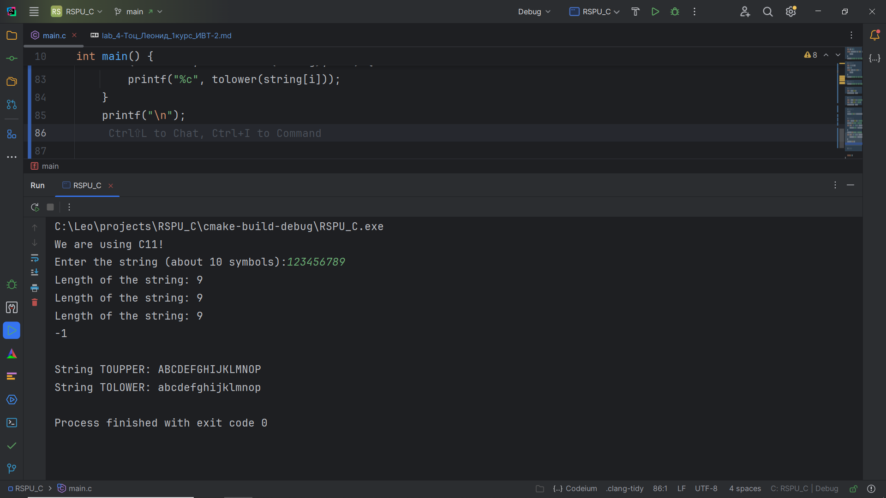

# Лабораторная работа №4. Введение в функции. Базовая работа со строками (однобайтовыми).

## Комплект 1. Введение в функции.
## Задание 1.1

### Постановка задачи
**Создайте две функции, которые вычисляют факториал числа:**
- функцию, которая вычисляет факториал, используя цикл;
- функцию, которая вычисляет факториал, используя рекурсивный
  вызов самой себя.

### Математическая модель


### Список идентификаторов
| Имя переменной | Тип переменной | Описание              |
|----------------|----------------|-----------------------|
| n              | unsigned int   | Неотрицательное число |


### Код программы
```c
#include <stdio.h>
#include <stdlib.h>

long long factorialCycle(unsigned int n) {
    long long result = 1;
    for (int i = 1; i <= n; i++) {
        result *= i;
    }
    return result;
}

long long factorialRecursion(unsigned int n) {
    if (n == 0) {
        return 1;
    }
    else {
        return n * factorialRecursion(n-1);
    }
}

int main() {
    unsigned int n = 4;
    printf("%lld\n%lld\n", factorialRecursion(n), factorialCycle(n));

    return 0;
}
```

### Результат работы программы


## Задание 1.2

### Постановка задачи
Объявите указатель на массив типа int и динамически выделите память для 12-ти элементов. Напишите функцию, которая поменяет значения чётных и нечётных ячеек массива.

### Список идентификаторов
| Имя переменной | Тип переменной | Описание                                                  |
|----------------|----------------|-----------------------------------------------------------|
| SIZE           | int            | Количество элементов массива / размер массива / константа |
| arr            | \*int          | Указатель на массив                                       |


### Код программы
```c
#include <stdio.h>
#include <stdlib.h>

void swap(int *a, int *b) {
    *a += *b;
    *b = *a - *b;
    *a -= *b;
}

int main() {
    int SIZE = 12;
    int *arr = (int *) malloc(SIZE * sizeof(int));

    for (int i = 0; i < SIZE; i++) {
        arr[i] = i + 1;
        printf("%d ", arr[i]);
    }
    printf("\n");

    for (int i = 0; i < SIZE; i += 2) {
        swap(&arr[i], &arr[i+1]);
    }
    
    for (int i = 0; i < SIZE; i++) {
        printf("%d ", arr[i]);
    }
    printf("\n");

    free(arr);

    return 0;
}
```

### Результат работы программы


## Задание 1.3

### Постановка задачи
**Создать две основные функции:**
- функцию для динамического выделения памяти под двумерный
  динамический массив типа double — матрицу;
- функцию для динамического освобождения памяти под двумерный динамический массив типа double — матрицу.

**Создать две вспомогательные функции:**
- функцию для заполнения матрицы типа double;
- функцию для распечатки этой матрицы на экране.
  Продемонстрировать работу всех этих функций в своей программе.

### Список идентификаторов
| Имя переменной | Тип переменной | Описание                |
|----------------|----------------|-------------------------|
| rows           | int            | Кол-во строк матрицы    |
| cols           | int            | Кол-во столбцов матрицы |
| matrix         | double\*\*     | Матрица                 |


### Код программы
```c
#include <stdio.h>
#include <stdlib.h>

double **mallocMatrix(int rows, int cols) {
    double **matrix = (double **) malloc(rows * sizeof(double *));
    for (int i = 0; i < rows; i++) {
        matrix[i] = (double *) malloc(cols * sizeof(double));
    }
    return matrix;
}

void freeMatrix(double **matrix, int rows) {
    if (matrix == NULL) {
        printf("matrix is NULL\n");
        return;
    }
    for (int i = 0; i < rows; i++) {
        free(matrix[i]);
    }
    free(matrix);
}

void fillMatrix(double **matrix, int rows, int cols) {
    if (matrix == NULL) {
        printf("matrix is NULL\n");
        return;
    }
    for (int i = 0; i < rows; i++) {
        for (int j = 0; j < cols; j++) {
            matrix[i][j] = (double) rand() / RAND_MAX * 10;
        }
    }
}

void printMatrix(double **matrix, int rows, int cols) {
    if (matrix == NULL) {
        printf("matrix is NULL\n");
        return;
    }
    for (int i = 0; i < rows; i++) {
        for (int j = 0; j < cols; j++) {
            printf("%6.2f ", matrix[i][j]);
        }
        printf("\n");
    }
    printf("\n");
}

int main() {
    int rows = 10, cols = 10;
    double **matrix = mallocMatrix(rows, cols);
    fillMatrix(matrix, rows, cols);
    printMatrix(matrix, rows, cols);
    freeMatrix(matrix, rows);

    return 0;
}
```

### Результат работы программы


## Задание 1.4

### Постановка задачи
Создать функцию, которая вычисляет векторное произведение двух
векторов в декартовых координатах, используя указатели на соответствующие массивы.

### Математическая модель


### Список идентификаторов
| Имя переменной | Тип переменной | Описание                                     |
|----------------|----------------|----------------------------------------------|
| v1             | int\*          | Вектор                                       |
| v2             | int\*          | Вектор                                       |
| v3             | int\*          | Вектор                                       |
| x              | const int      | Координата вектора (x, y, z) / индекс. x = 0 |
| y              | const int      | Координата вектора (x, y, z) / индекс. y = 0 |
| z              | const int      | Координата вектора (x, y, z) / индекс. z = 0 |


### Код программы
```c
#include <stdio.h>
#include <stdlib.h>

enum coordinates {
    x, y, z
};

// Векторное произведение векторов
int* VectorMultiplication(const int* v1, const int* v2) {
    int *v3 = malloc(3*sizeof(int));

    v3[x] = (v1[y] * v2[z]) - (v2[y] * v1[z]);
    v3[y] = -((v1[x] * v2[z]) - (v2[x] * v1[z]));
    v3[z] = (v1[x] * v2[y]) - (v2[x] * v1[y]);

    return v3;
}


int main() {
    int *v1 = (int*) malloc(3*sizeof(int));
    int *v2 = (int*) malloc(3*sizeof(int));

    // Задаём вектора
    v1[x] = 1;
    v1[y] = 2;
    v1[z] = 3;

    v2[x] = 4;
    v2[y] = 5;
    v2[z] = 6;

    int *v3 = VectorMultiplication(v1, v2);
    printf("v1: %d %d %d\n", v1[x], v1[y], v1[z]);
    printf("v2: %d %d %d\n\n", v2[x], v2[y], v2[z]);
    printf("v1 * v2 = v3: %d %d %d\n", v3[x], v3[y], v3[z]);


    free(v1);
    free(v2);
    free(v3);

    return 0;
}
```
### Результат работы программы


## Комплект 2: Базовые операции со строками.
Включите в программы для упражнений директиву `#include <string.h>`
для базовой работы со строками. Для ввода строк с клавиатуры используйте
функции `char ∗gets(char ∗str);` (до C11) или
`char ∗gets_s(char ∗str, rsize_t n);` (начиная с C11 у Microsoft) или
`char ∗fgets(char ∗str, int count, FILE ∗stream);` — более современный и стандартный вариант.
Либо можно использовать
`int scanf(const char ∗format, ...);` или
`int scanf_s(const char ∗restrict format, ...);` (начиная сC11 у Microsoft)
или
`int fscanf(FILE ∗stream, const char ∗format, ... );` — более современный и стандартный вариант. Для параметра stream используйте идентификатор для потока стандартного ввода `stdin (файл <stdio.h>)`. Рекомендуется использовать включение `#include <locale.h>` и использовать
вызов
`setlocale(LC_ALL, "en_US.iso88591");` в начале программы.
Самостоятельно посмотрите функции `puts` и `fputs` для вывода в стандартный поток вывода `stdout`.

## Задание 2.1

### Постановка задачи
Создайте новую программу, где с клавиатуры вводится строка некоторой длины порядка 10 латинских символов (не используйте кириллицу) в классическую строку языка C, которая имеет вид массива
`char my_string[MY_SIZE]`. `MY_SIZE` определите с помощью директивы `#define`. Значение `MY_SIZE` должно превышать длину вводимой
строки с некоторым разумным запасом. Другие строки в этой задаче
можете создавать либо также как статические массивы, либо как динамические массивы, но не забывайте освобождать от динамически
выделенную память с помощью функции
`void free(void∗ ptr);`

**Выполните следующие действия и распечатайте результаты:**
1. Вычислите длину строки `my_string`, используя цикл `for` и тот
   факт, что в языке C такие строки имеют в конце специальный нулевой символ конца строки, представленный escape-последовательностью
   `'\0'` ('...' — это тип char).
2. Сделайте то же самое, что в пункте 1, но создайте указатель на
   начало вашей строки и используйте операцию инкремента ++.
3. Используйте функции
   `size_t strlen(const char∗ str);` или `size_t strnlen (const char ∗string, size_t maxlen);` или
   `size_t strnlen_s(const char ∗str, size_t strsz);` для получения размера строки в виде значения `size_t` (псевдоним
   unsigned int, спецификатор форматирования — `"%zu"`). Убедитесь, что ваш компилятор явно работает с опцией - `std=c11` или с
   опцией для более позднего стандарта языка для поддержки функции `strnlen_s`.
4. Создайте вторую строку (второй массив) и скопируйте в неё строку `my_string`, используя функцию
   `char ∗strcpy(char ∗dest, const char ∗src);` или
   `char ∗strncpy (char ∗dest, const char ∗src, size_t n);`.
5. Создайте ещё две строки какого-либо размера и задайте их прямо
   в коде без клавиатуры. Сделайте конкатенацию этих двух строк,
   используя
   `char ∗strcat(char ∗dest, const char ∗src);` или
   `char ∗strncat(char ∗dest, const char ∗src, size_t n);`. Первую
   строку трактуйте как dest (destination) и подберите размер этого
   массива с запасом.
6. Сравните две новые строки, заданные в коде строковыми литералами, используя функцию
   `int strcmp(const char ∗lhs, const char ∗rhs);` или
   `int strncmp (const char ∗s1, const char ∗s2, size_t n)`.
7. Задайте прямо в коде строку, в которой есть только латинские
   символы в верхнем и нижнем регистре. Переведите строку полностью в нижний регистр и отдельно полностью в верхний регистр. Распечатайте каждый результат отдельно. Найдите сигнатуры подходящих функций (`tolower` и `toupper`), изучив базовые
   однобайтовые строковые функции по ссылке
   https://en.cppreference.com/w/c/string/byte.


### Список идентификаторов
| Имя переменной | Тип переменной | Описание                                                      |
|----------------|----------------|---------------------------------------------------------------|
| SIZE           | const int      | Размер массива                                                |
| my_string      | char           | Строка, заданная пользователем                                |
| str            | char*          | Строка, заданная пользователем                                |
| len            | int            | Длина строки                                                  |
| p              | char*          | Указатель на начало строки                                    |
| str2           | char           | Вторая строка                                                 |
| dest           | char*          | Указатель на начало строки                                    |
| src            | char*          | Указатель на начало строки                                    |
| string         | char           | Строка / набор заглавных и прописных букв латинского алфавита |


### Код программы
```c
#include <stdio.h>
#include <stdlib.h>
#include <string.h>
#include <locale.h>
#include <ctype.h>

#define SIZE 20


int main() {
    // Узнаём версию языка C
    #if defined __STDC_VERSION__
        if (__STDC_VERSION__ == 202000) {
            printf("We are using C23!\n");
        } else if (__STDC_VERSION__ == 201710L) {
            printf("We are using C17!\n");
        } else if (__STDC_VERSION__ == 201112L) {
            printf("We are using C11!\n");
        } else if (__STDC_VERSION__ == 199901L) {
            printf("We are using C99!\n");
        }
    #else
        printf("We are using C90!\n");
    #endif


    // Начало
    setlocale(LC_ALL, "en_US.iso88591");
    printf("Enter the string (about 10 symbols):");
    char str[SIZE];
    gets(str);

    // Пункт 1
    int len = 0;
    while (str[len] != '\0') {
        len++;
    }
    printf("Length of the string: %d\n", len);

    // Пункт 2
    char *p = str;
    len = 0;
    while (*p++ != '\0') {
        len++;
    }
    printf("Length of the string: %d\n", len);

    // Пункт 3
    printf("Length of the string: %llu\n", strlen(str));

    // Пункт 4
    char str2[SIZE];
    strcpy(str2, str);

    // Пункт 5
    char dest[SIZE] = "Leonid";
    char src[SIZE] = "Tots";
    strcat(dest, src);

    // Пункт 6
    /*
    Сравнение строк с помощью функции strcmp происходит следующим образом:
    Функция принимает две строки и сравнивает по очереди каждый символ между собой.
    Сравнение начинается с первого символа и продолжается до тех пор, пока не будет найден различный символ
    или не будет достигнут конец строки.
    Как только функция находит первый символ, который различается, она возвращает:
        1, если символ в первой строке больше символа во второй.
        -1, если этот первый различающийся символ меньше в первой строке.
        0, если строки равны между собой (нет различающихся символов).
    Если различающийся символ найти не удалось, но одна из строк закончилась раньше другой,
    то она будет считаться меньшей из двух.
    */
    printf("%d\n", strcmp(dest, src));

    // Пункт 7
    char string[SIZE] = "AbCdEfGhIjKlMnOp";
    printf("\nString TOUPPER: ");
    for (int i = 0; i < strlen(string); i++) {
        printf("%c", toupper(string[i]));
    }
    printf("\nString TOLOWER: ");
    for (int i = 0; i < strlen(string); i++) {
        printf("%c", tolower(string[i]));
    }
    printf("\n");


    // Конец


    return 0;
}
```
### Результат работы программы


## Задание 2.2

### Постановка задачи
Конвертируйте введённые заданные как строки: число с плавающей
точкой (`double`) и целое число (`int`) в значения типа `double` и `int`, используя функциями `atof` и `atoi`.
Смотри документацию по ссылке: https://en.cppreference.com/w/c/string/byte.

### Список идентификаторов
| Имя переменной | Тип переменной | Описание                                                      |
|----------------|----------------|---------------------------------------------------------------|
| SIZE           | const int      | Размер массива                                                |
| str_double     | char           | Строка, заданная пользователем                                |
| str_int        | char           | Строка, заданная пользователем                                |

### Код программы
```c
#include <stdio.h>
#include <stdlib.h>
#include <string.h>
#include <locale.h>
#include <ctype.h>

#define SIZE 20

int main() {
    printf("Enter the double number:");
    char str_double[SIZE];
    gets(str_double);

    printf("Enter the integer number:");
    char str_int[SIZE];
    gets(str_int);
    
    printf("\nDouble number: %f\n", atof(str_double));
    printf("Integer number: %d\n", atoi(str_int));


    return 0;
}
```
### Результат работы программы


## Задание 2.3

### Постановка задачи
Создайте строку от 10 до 20 символов, используя только цифры, латинский буквы в разных регистрах пробельные символы и символы
пунктуации. Организуйте цикл, где каждый символ подробно тестируется функциями типа `int is∗(/∗... ∗/)` (например — `isdigit`,
`ispunct`). Смотри документацию по ссылке
https://en.cppreference.com/w/c/string/byte. Оформите распечатку информации по каждому символу в виде списка на экране,
чтобы можно было прочесть информацию о том, что представляет собой каждый символ (своими словами, в свободной форме). Постарайтесь
использовать только латиницу.

### Список идентификаторов
| Имя переменной | Тип переменной | Описание         |
|----------------|----------------|------------------|
| SIZE           | const int      | Размер массива   |
| str            | char[]         | Строка           |

### Код программы
```c
#include <stdio.h>
#include <stdlib.h>
#include <string.h>
#include <locale.h>
#include <ctype.h>

#define SIZE 20

int main() {
    char str[SIZE] = "Leonid Tots 2005";

    for (int i = 0; i < strlen(str); i++) {
        printf("Symbol '%c':\n", str[i]);
        printf("   isalnum: %d\n", isalnum(str[i]));
        printf("   isalpha: %d\n", isalpha(str[i]));
        printf("   islower: %d\n", islower(str[i]));
        printf("   isupper: %d\n", isupper(str[i]));
        printf("   isdigit: %d\n", isdigit(str[i]));
        printf("   isxdigit: %d\n", isxdigit(str[i]));
        printf("   iscntrl: %d\n", iscntrl(str[i]));
        printf("   isgraph: %d\n", isgraph(str[i]));
        printf("   isspace: %d\n", isspace(str[i]));
        printf("   isblank: %d\n", isblank(str[i]));
        printf("   isprint: %d\n", isprint(str[i]));
        printf("   ispunct: %d\n", ispunct(str[i]));
    }
    
    return 0;
}
```

### Результат работы программы


## Информация о студенте
Тоц Леонид Александрович, 1 курс, ИВТ-2