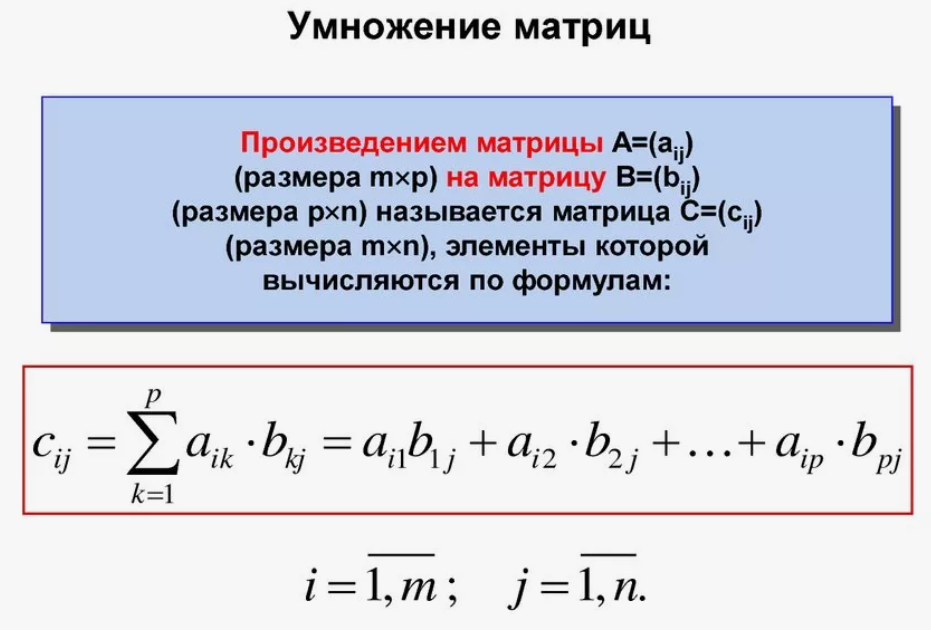
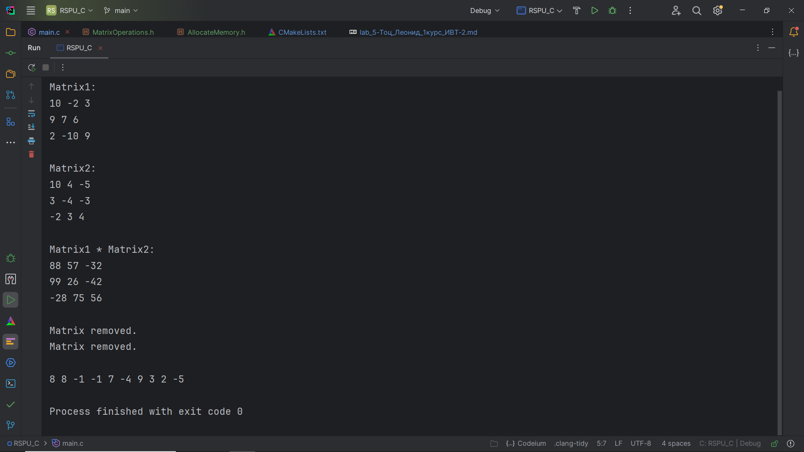

# Лабораторная работа №5. Многофайловый проект, условная компиляция, утилита Make.

## Комплект 1. Многофайловый проект, условная компиляция, утилита Make.

## Задание 1.1

### Постановка задачи
Напишите программу из нескольких файлов (модулей), включая файл
основной программы. Файлы должны содержать вынесенные отдельно функции для выделения памяти под динамические двумерные и
одномерные массивы и функции для перемножения матриц. Собрать
проект используя утилиту Make.

### Математическая модель


### Список идентификаторов
| Имя переменной | Тип переменной                        | Описание                            |
|----------------|---------------------------------------|-------------------------------------|
| col1           | целое число                           | Количество столбцов первой матрицы  |
| row1           | целое число                           | Количество строк первой матрицы     |
| matrix1        | указатель на указатель на целое число | Первая матрица                      |
| col2           | целое число                           | Количество столбцов второй матрицы  |
| row2           | целое число                           | Количество строк второй матрицы     |
| matrix2        | указатель на указатель на целое число | Вторая матрица                      |
| matrix3        | указатель на указатель на целое число | Результирующая матрица произведения |
| size           | целое число                           | Размер одномерного массива          |
| arr            | указатель на целое число              | Одномерный массив                   |


### Код программы
### main.cpp
```c
#ifndef MAIN_C // если НЕ определена константа MAIN_C
#include <stdio.h>
#include "MatrixOperations.h"
#define MAIN_C // то определить ее
#endif


int main() {

    const int col1 = 3, row1 = 3;
    int** matrix1 = IntMatrix(col1, row1);
    IntMatRand(matrix1, col1, row1);
    printf("Matrix1:\n");
    MatPrint(matrix1, col1, row1);

    const int col2 = 3, row2 = 3;
    int** matrix2 = IntMatrix(col2, row2);
    IntMatRand(matrix2, col2, row2);
    printf("\nMatrix2:\n");
    MatPrint(matrix2, col2, row2);

    printf("\nMatrix1 * Matrix2:\n");
    int** matrix3 = MultiplyMatrix(matrix1, col1, row1, matrix2, col2, row2);
    MatPrint(matrix3, col1, row2);
    printf("\n");

    DelIntMatrix(matrix1, col1);
    DelIntMatrix(matrix2, col2);

    const int size = 10;
    int *arr = IntArray(size);
    IntArrRand(arr, size);
    printf("\n");
    ArrPrint(arr, size);

    return 0;
}
```
### MatrixOperations.h
```c
#ifndef RSPU_C_MATRIXOPERATIONS_H
#define RSPU_C_MATRIXOPERATIONS_H

#include "AllocateMemory.h"

int** MultiplyMatrix(int** matrix1, int col1, int row1, int** matrix2, int col2, int row2) {
    if (row1 != col2) {
        printf("Cannot multiply matrix with sizes %d*%d and %d*%d\n", row1, col1, row2, col2);
        return NULL;
    }
    
    int** result = (int**)malloc(col1 * sizeof(int*));
    for (int i = 0; i < col1; i++) {
        result[i] = (int*)malloc(row2 * sizeof(int));
    }
    
    for (int i = 0; i < col1; i++) {
        for (int j = 0; j < row2; j++) {
            result[i][j] = 0;
            for (int k = 0; k < row1; k++) {
                result[i][j] += matrix1[i][k] * matrix2[k][j];
            }
        }
    }
    
    return result;
}

void IntMatRand(int** matrix, int col, int row) {
    for (int i = 0; i < col; i++) {
        for (int g = 0; g < row; g++) {
            matrix[i][g] = rand() % (20 + 1) - 10;
        }
    }
}

void IntArrRand(int *arr, int size) {
    for (int i = 0; i < size; i++) {
        arr[i] = rand() % (20 + 1) - 10;
    }
}

void MatPrint(int **matrix, int col, int row) {
    for (int i = 0; i < col; i++) {
        for (int g = 0; g < row; g++) {
            printf("%d ", matrix[i][g]);
        }
        printf("\n");
    }
}

void ArrPrint(int *arr, int size) {
    for (int i = 0; i < size; i++) {
        printf("%d ", arr[i]);
    }
    printf("\n");
}

#endif //RSPU_C_MATRIXOPERATIONS_H
```
### AllocatedMemory.h
```c
#ifndef RSPU_C_ALLOCATEMEMORY_H // если НЕ определена константа RSPU_C_ALLOCATEMEMORY_H
#define RSPU_C_ALLOCATEMEMORY_H // определяем константу SOMECODE_H
#include <malloc.h>

int* IntArray(int size) {
    return (int*) malloc(size * sizeof(int));
}

int** IntMatrix(int col, int row) {
    int** mat = (int**) malloc(col * sizeof(int*));
    for (int i = 0; i < col; i++) {
        mat[i] = (int*) malloc(row * sizeof(int));
    }
    return mat;
}

void DelIntArray(int* arr) {
    free(arr);
    printf("Array deleted.\n");
}

void DelIntMatrix(int** matrix, int col) {
    for (int i = 0; i < col; i++) {
        free(matrix[i]);
    }
    free(matrix);
    printf("Matrix removed.\n");
}

#endif //RSPU_C_ALLOCATEMEMORY_H
```
### Makefile.txt
```makefile

```
## Результат работы программы


## Информация о студенте
Тоц Леонид Александрович, 1 курс, ИВТ-2